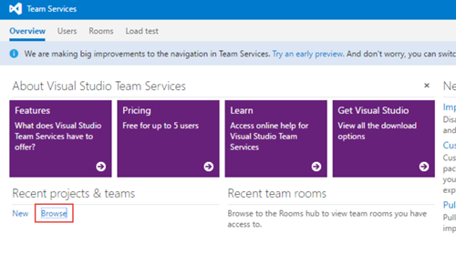
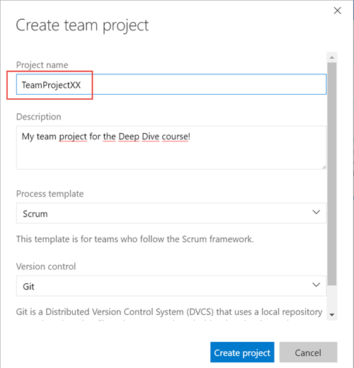
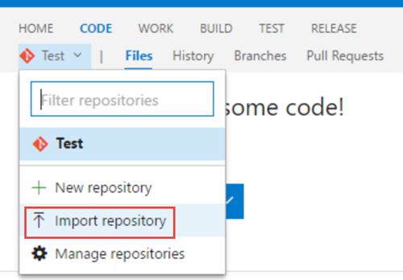
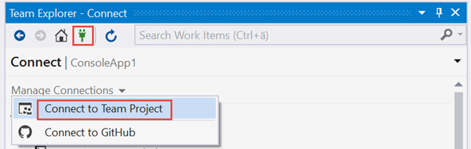
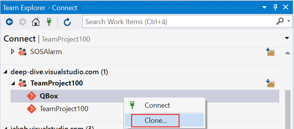
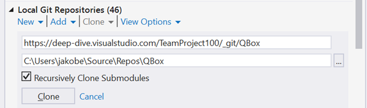
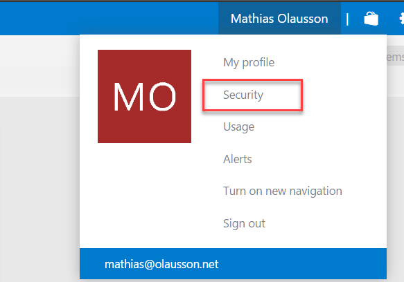
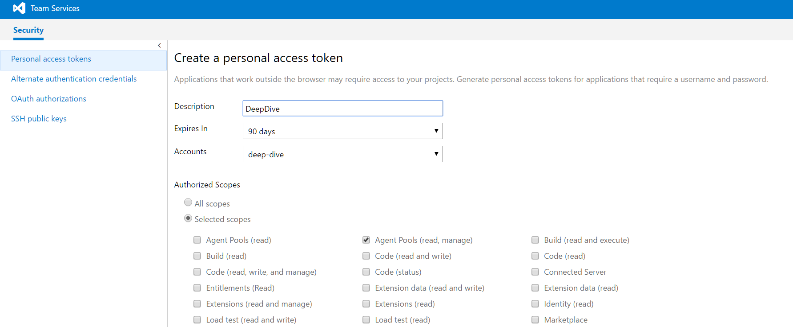
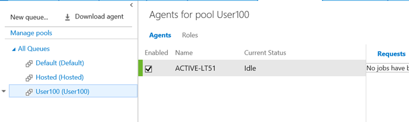
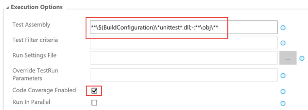

# Exercise 1 - Build and Package

Expected time for this exercise: 45 minutes.

## Learnings
In this exercise you will learn to:

1. Install and configure a build environment
2. Setup a build process
3. Extend the build process with custom activities


First, we will create a team project for your team and import the source code repository

## Creating a team project

1. Open a web browser and browse to https://deep-dive.visualstudio.com/

2. Login using your assigned user login and password (*userxx@devopstraining.onmicrosoft.com* / *P2ssw0rd!*)
 
3. Click on the *New* link to create a new team project

    

4. For the name of the team project, enter *TeamProject* + your assigned team id, for example *TeamProject03*. Select *Scrum* as the Process template and make sure that *Git* is used for Version control.

    
 
5. Click create and wait for the project to be created


## Importing the sample project

4. After the project has been created, go to the *Code* hub group

5. From the repository selector drop-down, click *Import repository*

    

6. In the *Clone URL* field, enter the following URL:

```
https://github.com/solidifysv/QBox.git

``` 

7. Click *Import* to import the QBox repository into a new Git repo in your team project

## Cloning the project in Visual Studio

1. Start Visual Studio and open the Team Explorer window (*View -> Team Explorer*)

2. Press the *Manage Connections* button, and the select *Manage Connections -> Connect to Team Project*

    

3. Click on  *Servers...* and then *Add* to add a connection to the deep-dive project

    
    
4. Log in using your supplied credentials

5. Once connected, select your team project from the list of team projects

6. Clone the project by browsing to the QBox repository that is located beneath your team project in the Connect page:

    
    
7. Accept the default local path (which should be *%HOMEPATH%\source\repos\QBox*) and select *Clone*

    


# Configure the build environment
For this workshop we will use local build servers. In this step you will setup a local 
agent on your own machine to simulate an internal build server running against VSTS.

### Create a build pool
1. Go to the VSTS team settings and select the Agent Queue hub.
2. Click the "New queue..." button and create a queue and also a new pool, name it
by your assigned user id (i.e. UserNN).


### Create a Personal Access Token for the build agent
In order to setup the build agent we need a way to configure how it can access
resources in VSTS. The way we do this is by using a personal access token (PAT).

1. Login to the VSTS account and click on the profile link and select Security.



2. Add a new Personal access token, name it **DeepDive** and authorize it to the 
**Agent Pools (read, manage)** scope.



3. Copy the PAT token and save it in a temporary notepad file, we will use it in 
the next step when we configure the agent.

More information about personal access tokens:

[Create VSTS PAT](https://www.visualstudio.com/en-us/docs/setup-admin/team-services/use-personal-access-tokens-to-authenticate)

### Install a local build agent
1. Go to the VSTS team settings and select the Agent Queue hub.
2. Click on the "Download agent" button to download the agent. Review the steps in the dialog 
since it may have change since this text was written...
3. Open a PowerShell command prompt as administrator.
4. Run the following commands to extract the agent:

    ```
    mkdir c:\vsts-agent
    cd c:\vsts-agent
    Add-Type -AssemblyName System.IO.Compression.FileSystem ; [System.IO.Compression.ZipFile]::ExtractToDirectory("$HOME\Downloads\vsts-agent-win7-x64-2.107.0.zip", "$PWD")
    ```

5. Configure the agent. Provide the **agent queue** created earlier, the account name **https://deep-dive.visualstudio.com** and 
use the **PAT** from the previous step.

    ```
    .\config.cmd
    ```

6. Run the agent interactively

    ```
    .\run.cmd
    ```

7. Now the agent should be up and running. Switch back to the VSTS team settings and look at
the status in the agent queue.



## Create a build definition
With the build infrastructure in place it's time to create a build process. In this scenario
you will create both a continuous integration build and then also a variant to be used for the
release builds.

### CI build
1. Go to the **Build** hub 

2. Click on the **"+ New"** button.

3. There are several templates to choose from, select the **Visual Studio** template.


4. Next configure the initial settings for the build definition. Select the team project as
the repository source, use the code repository created in lab 0 (QuizBox), use Master as the
default branch, enable CI and use the build queue created earier in this lab (UserNN).


5. The template build definition contains several steps, for the CI build we only need the
NuGet restore, Build solution and Test Assemblies tasks. Remove the rest.

6. Configure the NuGet restore task to use Source/QBox.sln instead of all solution files (**\*.sln).

7. Configure the Build solution task to build Source/QBox.sln.

8. Configure the Unit test task to only test \*unittest\* assemblies and enable code coverage.



9. Select the Variables tab and add a variable named ApplicationVersion with the value 2.0.

10. Select the General tab and change the build format name to 
$(BuildDefinitionName)_$(SourceBranchName)_$(ApplicationVersion)$(rev:.r).0

11. Save the build definition as QBox.CI. 

12. Queue a new build and make sure it passes. Note how the build number format is generated.

### Add versioning to the build definition

1. Go to the Build tab in the build definition.
2. Add a new PowerShell build step to the process (it's in the Utility category)
and move it first in the process.

The cloned code repository contains a PowerShell script that will update the
assembly information with the number from the build. 

3. Set the Script path to the versioning script, Scripts/ApplyVersionToAssemblies.ps1.
4. Set the arguments to "$(Build.SourcesDirectory)" "$(Build.BuildNumber)".

The completed build step (and process) should look something like this:


### Release build
Next you will create a build definition for the release build. Most often the release build
has the same logic as a CI build but also performs additional steps as required by the release
process.

1. Clone the build definition by right-clicking on the build definition.


2. Update the Build solution step to create a WebDeploy package by adding the following
msbuild arguments: /p:DeployOnBuild=true /p:PublishProfile=CreatePackage

3. Add Copy Publish Artifact steps to the process to publish the different components
from the build.

| Artifact Name | Copy Root | Contents | Artifact Type |
|---|---|---|---|
| Frontend | $(build.sourcesDirectory) | source\QBox.Web\deploy\\\*.* | server |
| Backend | $(build.sourcesDirectory) | source\QBox.Api\deploy\\\*.* | server |
| Scripts | Scripts | \*\*\\\*.\* | Server |
| Tests | | \*\*\\*Tests.dll | Server |
| Database | | \*\*\\*.dacpac | Server |
| UITests | Source/QBox.Web.UITests | \*\*\bin\release\\\*.* | Server |
| ARMTemplate | $(build.sourcesDirectory) | source\QuizBox.AzureResourceGroup\Templates\\\*.* | Server |

4. Select the Repository tab and set Clean to True.
5. Select the Triggers tab and remove the CI trigger.
6. Save the build definition as QBox.Release.
7. Queue a build and make sure it passes.

## Further ideas
By now you should have completed the core steps of setting up a build pipeline. Well done! 
If you still have time and in the mood for some additional challenges here are a couple of 
ideas to explore.

* Use GitVersion to handle the build version number.

    [Using GitVersion with TFS Build vNext](https://gitversion.readthedocs.io/en/latest/build-server-support/build-server/tfs-build-vnext/)

* Install Catlight.io and use it to monitor your build status.

    [Catlight.io](https://catlight.io/a/vsts-build-status-notifications)
