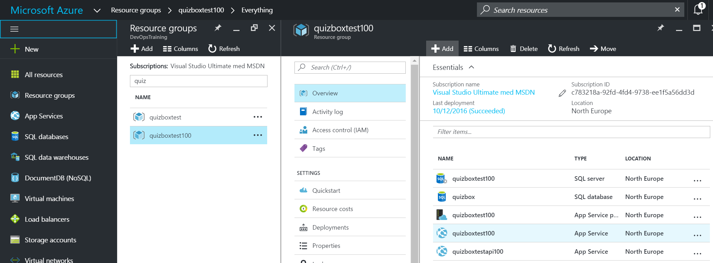
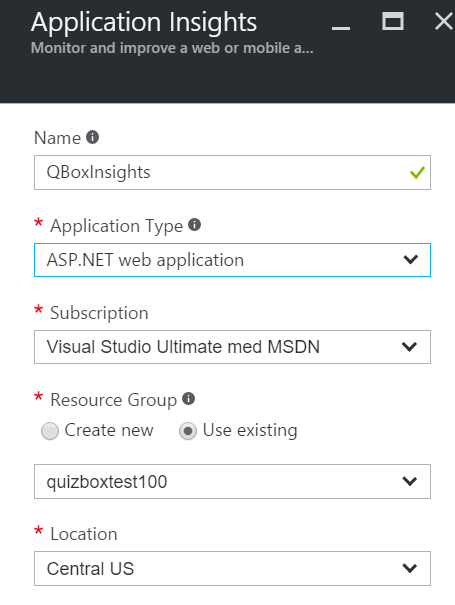
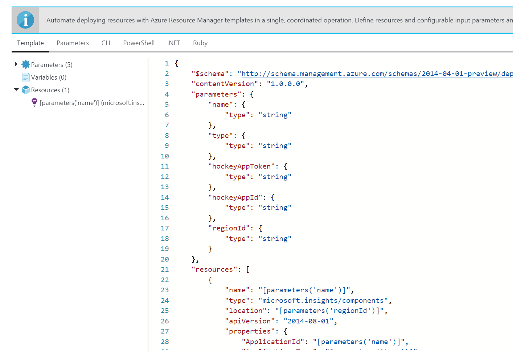
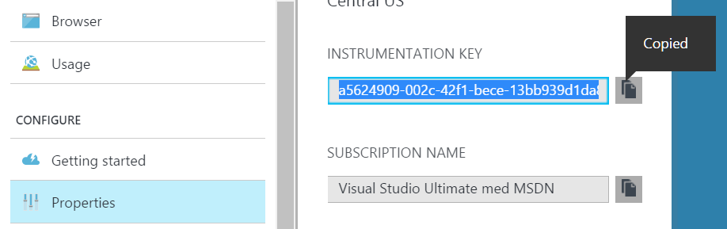
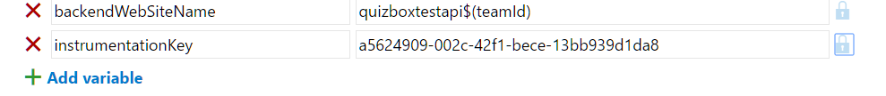
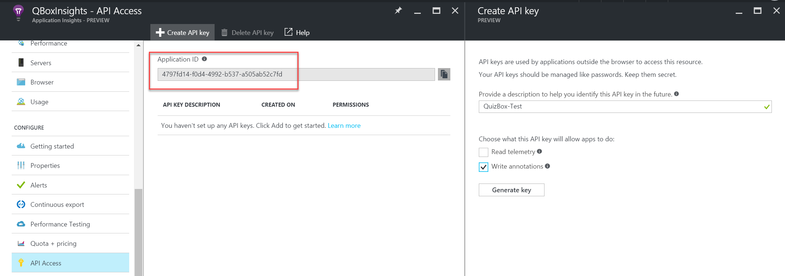
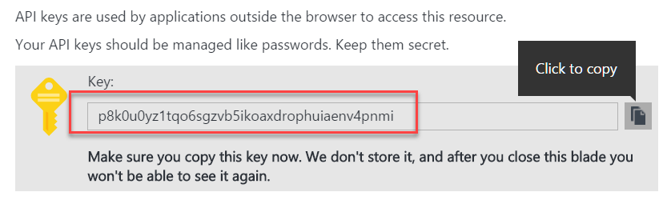
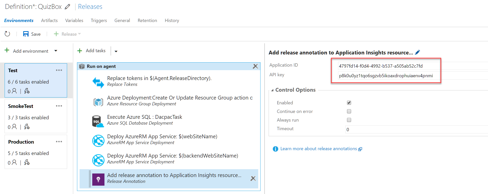
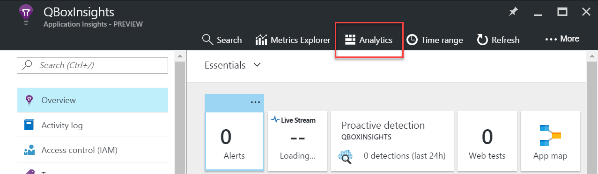

# Exercise 4 - Application Monitoring

Expected time for this exercise: 30 minutes.

## Learnings
In this exercise you will learn to:

1. Add an Application Insights Resource to an Azure Resource Group
2. Add application monitoring to your application
3. Extend the release management pipeline to include Application Insights annotations
4. Use the Application Insights Analytics service to understand your application better

## Setup / prerequisites

You need to have done lab 03 - Release Management in order to complete this lab.

## Add an Application Insights Resource to an Azure Resource Group

In this exercise you will add an Application Insights resource to the resource group
created earlier. 

1. Go to the Azure portal and select the **QuizBoxTest\<userid\>** resource group.

2. Add a new Application Insights resource to the resource group. Name the resource **QBoxInsights**, 
use the defaults for the other values.

If you are curious what the ARM definition would look like you can take a look at 
it by pressing the Automation options at the bottom of the screen.

3. Press Create to create the resource.
4. Wait for the resource to be created, then refresh the resource group and select
the newly created AI resource. Click **properties** and note the **Instrumentation Key**, you are going to use it
in a little while.

## Using Application Insight in your application

In this step you will explore the existing AI code in the QuizBox application. For a quick summary
of the steps to add AI to your project, have a look here:

[Set up Application Insights for ASP.NET](https://azure.microsoft.com/en-us/documentation/articles/app-insights-asp-net/)

Now lets have a look at the code;

1. Switch to the QuizBox solution in Visual Studio and select the QBox.Web project.
2. Open the web.config file and notice that it contains a **InstrumentationKey** application setting. 
The InstrumentationKey will be replaced at deployment time by WebDeploy, again using the parameter match
rule in the **parameters.xml** file so have a look there as well. 
3. Open the Global.asax file and note how AI is initialized in the **Application_Start** event. Also
note how there is a global error handler that will pass the exceptions to the AI service by calling 
the **TrackException** method.
4. Next let's take a look at how we can send custom events to Application Insights.
Open the **CategoryController.cs** file and locate the **Start** method. This method is called
when a user selects a quiz category so it's a good place to track how often the different
categories are used. The event is logged using the Logger.Event helper. Go to the implementation
and note how the data is passed to the **TrackEvent** method.

## Update the release management pipeline to set the AI key

In order to have the AI telemetry sent to the right resource group we must Update
the application insights configuration in the environment. Since we've already implemented
a strategy to parameterize the environment specific details and have it applied
during the deployment we can do the same for the AI key.

1. Go to the Release hub in VSTS and edit the release definition.
2. Select the Test environment and **Configure variables** for the environment. 
Add a variable **instrumentationKey** with the value of the instrumentation key for
the AI resource created earlier in the exercise.

3. Save the release definition and create a new release and deploy it to the Test environment.
4. Wait for the deployment to complete, then open the QuizBox website, **https://quizboxtest$(teamId).azurewebsites.net**, and take
a quiz or two.
5. Open the Azure portal, select the **QuizBoxTest\<userid\>** resource group and open the AI
resource. Look at the telemetry data received from the application.

## Extend the release management pipeline to include AI annotations

When using Application Insights it can often be very valuable to know when there has been
a release. AI has a built in capability for this so when a new build is deployed we can
notify AI about that and get a release marker in the AI timelines. In this example
you are going to add a new task in the release definition that sends information to AI
when a release is made to a particular environment. The build task we use is available from the
Visual Studio Marketplace and has already been installed in your account. Take a look at the 
documentation for the task here:

[Release Annotations for Application Insights](https://marketplace.visualstudio.com/items?itemName=ms-appinsights.appinsightsreleaseannotations)

The task requires two parameters; an application id for the AI application and an Api key used to access 
the AI resource.

**NOTE**: Currently there is no api to create the application insights application id so
for now we have to create it manually.

1. Go to the Azure portal, select the QuizBox resource group and open the application insights resource.
2. Find the API access configuration and create a new API key. Name the key **QuizBox-Test**
and allow it to write annotations.

3. Copy the generated key and paste it in a temporary notepad page.

4. Also copy the AI application ID.

Next we can add the Add release annotation to Application Insights resource 
to our release definition.

1. Open the QuizBox release definition.
2. Select the Test environment and add the task **Release Annotation** from the
Deployment category.
3. Configure the step with the **Application Id** and **API key** generated earlier.

4. Save the release definition and create a new release to the Test environment.
5. Wait for the deployment to the Test environment has completed. Again run a
couple of quiz to get some telemetry data from the application. 
6. Go to the Azure portal, select the **QuizBoxTest\<userid\>** resource group and look at the
application insights resource. Note that the release has been annotated to the
AI timelines.

## Use Application Insights Analytics to understand AI telemetry

The Application Insights Analytics is a powerful service that lets you query the
AI telemetry data so that you can better understand how your application behaves.

In this step you will explore the telemetry data using the Application Insights 
Analytics service.

1. Go to the Azure portal, select the QuizBox resource group and open the
Application Insights resource.
2. Press the **Analytics** button from the Overview page.

3. Explore the data from the **QuizBoxTest** environment using the examples in the portal.

If your application did not generate enough data to analyze there is also a
demo instance here:

[AI Analytics Demo](https://analytics.applicationinsights.io/demo#/discover/home)

## Further ideas
* Explore the possibility to add the AI resource to the ARM template and have it updated
by the RM pipeline.
